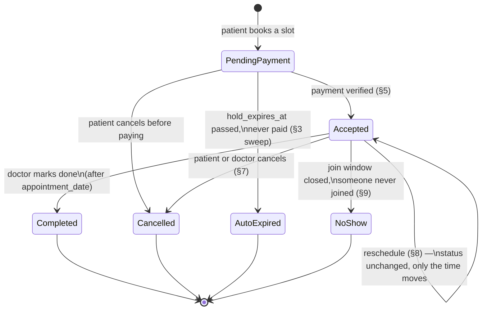

# MediBridge — Business Logic

Every rule the platform enforces, why it exists, and where it lives in code.
This is the companion to [DATABASE.md](DATABASE.md) (schema + ER diagram) and
[API_REFERENCE.md](API_REFERENCE.md) (endpoints) — this document is about
*behaviour*: what happens when a patient books, pays, cancels, or a doctor
never joins the call.

## Contents

1. [Identity & authentication](#1-identity--authentication)
2. [Doctors, specializations & scheduling](#2-doctors-specializations--scheduling)
3. [The booking lifecycle](#3-the-booking-lifecycle)
4. [Pricing — fee snapshots and the second-opinion premium](#4-pricing--fee-snapshots-and-the-second-opinion-premium)
5. [Payment — gateway integration and signature verification](#5-payment--gateway-integration-and-signature-verification)
6. [The video consultation & meeting link](#6-the-video-consultation--meeting-link)
7. [Cancellation & refund policy](#7-cancellation--refund-policy)
8. [Reschedule](#8-reschedule)
9. [No-show settlement](#9-no-show-settlement)
10. [The free follow-up window](#10-the-free-follow-up-window)
11. [Drug identity & interaction checking](#11-drug-identity--interaction-checking)
12. [Second opinion as a document](#12-second-opinion-as-a-document)
13. [Doctor earnings & payouts](#13-doctor-earnings--payouts)
14. [Ratings & reviews](#14-ratings--reviews)
15. [Notifications](#15-notifications)
16. [Live queue & "next available" matching](#16-live-queue--next-available-matching)
17. [Family / dependent profiles](#17-family--dependent-profiles)
18. [Security invariants](#18-security-invariants)
19. [Scheduled jobs, at a glance](#19-scheduled-jobs-at-a-glance)
20. [System settings reference](#20-system-settings-reference)
21. [Appointment status — state machine](#21-appointment-status--state-machine)

---

## 1. Identity & authentication

**Three separate tables — `patient`, `doctor`, `admin` — each with its own
`password_hash`.** There is no shared `users` table. A doctor account implies
a licence an admin verified; folding it into the same table as patients would
make that guarantee harder to see and easier to accidentally weaken.

**The `role` sent at login is never trusted as authority.** `AuthService.login`
switches on it only to pick *which table to query* — `loginPatient` /
`loginDoctor` / `loginAdmin`. The actual authority for every request afterwards
comes from the row that was loaded and the JWT minted from it, never from a
client-supplied field. Claiming `role=ADMIN` in a request body with a patient's
credentials gets you nowhere; the password is checked against the `admin`
table, and a patient's hash was never written there.

**Login failures are indistinguishable.** Wrong email, wrong password, or an
OAuth-only account attempting a password login all return the same
"Invalid email or password" — never "no such user" or "this account uses
Google". Anything more specific would let an attacker enumerate which emails
are registered.

Three ways into a **patient** account, one each for doctor/admin:

- **Local (email + password)** — the default for all three roles. BCrypt-hashed.
- **Google Sign-In** (`patient` only) — matched on `google_sub`, Google's
  *stable* subject id, not on email (a Google account's email can change; the
  sub never does). `password_hash` is nullable for these rows, and the login
  path explicitly refuses a password login against a `GOOGLE`-provider row
  rather than comparing against `NULL` — a `NULL` compared with anything is
  `NULL`, never true, but the refusal is explicit so the behaviour doesn't
  depend on that SQL subtlety holding.
- **Phone OTP** (`patient` only) — a patient signs in with a mobile number and
  a six-digit code; an *unknown* number silently becomes a new account. Doctors
  and admins can't use this — a doctor account means a licence a human
  verified, and a SIM card is not that. See below.

### Phone OTP, in detail

- `phone_e164` is a **normalised lookup key**, kept separate from `phone` (the
  string the user typed and the UI displays, spaces and all — `"+91 90000 11111"`).
  The Java-side normaliser (`PhoneNumbers.toE164`) and the one-time SQL backfill
  reduce every number to the same canonical form; if the two ever disagreed,
  the system would text a number it can't resolve back to an account.
- The code itself is never stored — only `code_hash` (SHA-256). Six digits
  don't survive a determined offline attack on a hash, and that isn't the
  security claim: **TTL + attempt cap + single-use** are what make guessing
  pointless, and all three are columns checked against the row, not counters
  living in application memory (which a restart, or a second instance, would
  forget).
- `created_at` on `phone_otp` is load-bearing, not just an audit trail: the
  **resend cooldown** is derived from the newest row for a number. The
  in-memory, per-IP rate limiter (`AuthRateLimitFilter`) can't stop someone
  rotating source IPs to force sends — and every send costs money at the SMS
  gateway. A database fact can stop them; memory can't.
- No FK from `phone_otp` to `patient` — a code is issued to a *number*, and
  the entire point of auto-registration is that the account may not exist yet.

**Sessions** are JWT access tokens (short-lived) plus a rotating refresh token
stored **hashed** in `refresh_token`, keyed by `(user_type, user_id)` so it can
revoke correctly regardless of which identity table issued it. Logout revokes
the row; nothing about a hashed token in the database can be replayed by
someone who steals the table.

> **HS384, not HS256.** `JwtService`'s own javadoc says HS256 and is wrong —
> no explicit algorithm is passed to JJWT, so it silently picks the strongest
> the 62-byte key supports, which is HS384. Anything that verifies these
> tokens *outside* Spring must not hardcode HS256.

---

## 2. Doctors, specializations & scheduling

**`specialization`** is a lookup table, not free text — it exists specifically
because the registration dropdown and the doctor-listing filter used to
disagree on spelling ("Cardiology" vs "Cardiologist"). An FK closes that gap
permanently.

**Doctor status** is a small lifecycle: `pending → active`, with `inactive`
and `suspended` as admin-only exits. Self-registration lands a doctor in
`pending`; only an `active` doctor is bookable at all (`AppointmentService.book`
checks this explicitly) or shows up in public search. This is the platform's
one manual gate — nothing about a licence number or experience is verified
automatically.

**Two layers of scheduling data**, deliberately separate:

1. **`doctor_availability`** — the recurring **weekly template** the "Manage
   Schedule" screen actually edits: for each day of the week, is the doctor
   available, and in which half (morning 09:00–12:00 / afternoon 14:00–17:00).
2. **`doctor_schedule`** — **concrete, dated slots**, generated from the
   template and sliced into `consultation_duration_min`-sized chunks. This is
   the table a patient actually books against.

The split matters because a template edit ("I'm no longer free Tuesday
afternoons going forward") must not retroactively delete slots patients have
already paid for — only future, unbooked generation reads the template.
`doctor_schedule.is_booked` is a **denormalised read cache only**; the real
booking guard, discussed next, lives elsewhere entirely.

---

## 3. The booking lifecycle

MediBridge uses **slot-based confirmation**, the model Practo and Apollo 24|7
use: a doctor who publishes a slot has already agreed to be booked, so a
patient *paying for* that slot confirms it outright. There is no separate
accept/reject step where a doctor could turn away an already-paid patient.
(A doctor can still cancel afterwards — see §7 — which refunds automatically.)

**Real status flow:** `PendingPayment → Accepted → Completed`, with
`Cancelled` reachable from the first two, `AutoExpired` set only by the
hold-expiry sweep, and `NoShow` reachable only from `Accepted`. Two enum
values — `Requested` and `Rejected` — remain defined for a possible future
request-based flow but are **never produced** by the current code; don't read
them as reachable states today. (`Rescheduled` as a *status* is likewise
unused — rescheduling, §8, moves the *time*, not the status, and an appointment
stays `Accepted` throughout.)

### What happens on `POST /appointments` (book)

1. **Resolve the subject.** `family_member_id` is `null` for an ordinary
   self-booking; if set, it's verified to belong to the calling patient before
   use — a stranger's dependent id comes back as a plain 404, not a 403 (§18).
2. **Doctor must be `active`.** Anything else is rejected outright.
3. **Lock the slot row** (`SELECT ... FOR UPDATE`) and check it isn't already
   booked. This check is what makes the failure *readable* to the user — the
   guarantee that makes it *impossible* is the database constraint in step 5.
4. **Reject a slot in the past.**
5. **Snapshot the price** (§4) and insert the appointment as `PendingPayment`,
   with `hold_expires_at = now + slot_hold_minutes` (default 15).
   `appointmentRepository.saveAndFlush` is wrapped so a
   `DataIntegrityViolationException` — the `UNIQUE(schedule_id)` constraint
   firing because someone else won a race for the same slot in the gap between
   the check and the insert — comes back as a clean "that slot was just taken"
   rather than a 500.
6. Flip `doctor_schedule.is_booked = true` (the read cache, for calendar
   display) and notify the patient their booking is pending payment.

**Why the UNIQUE constraint, not the lock, is the real guard:** a pessimistic
lock only protects against another request going through *this exact code
path* at *this exact moment*. The `UNIQUE(schedule_id)` constraint on
`appointment` makes double-booking impossible regardless of timing, retries,
or a bug in the lock logic — two concurrent inserts for the same slot cannot
both succeed, full stop.

### Payment confirms the booking

`markPaidAndConfirm` is a no-op if the appointment has already left
`PendingPayment` (already confirmed by an earlier callback, or expired) —
this makes a duplicate gateway webhook harmless. Otherwise `confirm()`:

- sets `status = Accepted`, `confirmed_at = now`, clears `hold_expires_at`;
- generates the meeting link and computes its validity window
  (`meeting_join_from` / `meeting_valid_until`, §6);
- sends the booking-confirmed notification.

This `confirm()` method is shared with the free follow-up path (§10), which
has no payment to wait on — one code path reaching "confirmed" state means
there is exactly one place that can drift, and it can't be the one that
forgets to issue a meeting link.

### Abandoned checkouts self-heal

A slot held in `PendingPayment` blocks that time for everyone else. Without a
cleanup mechanism, closing the payment tab would hold it *forever*. The
`AppointmentScheduler.releaseExpiredHolds` job runs every minute, finds every
appointment whose `hold_expires_at` has passed, and — one at a time, each in
its own transaction so a single bad row can't stall the sweep — marks it
`AutoExpired` and frees the slot for someone else to book.

---

## 4. Pricing — fee snapshots and the second-opinion premium

**`booked_fee`, `platform_fee` and `total_amount` are written onto the
appointment at booking time**, not looked up again later. This is the
industry-standard fix for two real bugs the schema once had: a doctor raising
their rate mid-flight could change what an *already-booked* patient owed, and
an invoice needs to stay reproducible forever, even after the doctor's live
price has moved on.

`platform_fee` is a flat amount from `system_settings` (`platform_fee`,
default described below). It is charged to the *patient*, on top of the
consultation fee — and, importantly, it **never enters the doctor's ledger**
(§13); it is platform revenue for the use of the platform, not something
deducted from the doctor.

**Second opinion pricing:** reviewing another clinician's existing case file
is more work than a first consultation, so it's billed at a **percentage** of
the doctor's normal fee (`second_opinion_fee_percent`, default 150%) rather
than a flat surcharge — this keeps it proportional to each doctor's own rates.
The multiplier is applied once, at booking, for the same snapshot reason as
the base fee.

**Second opinion also has an eligibility gate**, checked before the fee is
even computed: the patient (or the dependent the visit is for) must have at
least `second_opinion_min_reports` (default 1) medical reports already
uploaded. A second opinion with nothing to review isn't a second opinion — the
specialist has no case file, and the patient would be paying a premium for a
consultation that can't deliver what was promised. Uploads are counted **for
whoever the visit is actually for** — a parent with ten reports of their own
still has nothing on file for a child they're booking for.

---

## 5. Payment — gateway integration and signature verification

Two gateways share one code path: **`SIMULATED`** (so the app runs end-to-end
with zero API keys — useful for demos and for this project's own development)
and **`RAZORPAY`** (the real one). `payment_transaction.gateway` records which
was used per row.

**Two-step flow, and step 2 is the one that actually matters:**

1. **Create order.** The backend creates a Razorpay order server-side
   (`gateway_order_id`) *before* checkout opens, and inserts a `Pending`
   `payment_transaction` row.
2. **Verify signature.** After checkout, the browser reports success — and
   that report **proves nothing**; a client can claim anything. The backend
   recomputes `HMAC_SHA256(order_id + "|" + payment_id, key_secret)` and
   compares it against the `gateway_signature` the client returned. Only a
   match is trusted. A mismatch is recorded as `Failed`, not silently dropped —
   a burst of failed verifications is exactly what a forged-payment attempt
   looks like, and it needs to be visible to whoever's watching the logs. The
   failure row is written in its own transaction so it survives the rollback
   that rejects the payment itself.

Only a verified `Paid` transaction triggers `markPaidAndConfirm` (§3).
**Refunds are real gateway calls**, not a status flip — `refund_amount`,
`refunded_at` and `gateway_refund_id` only get populated once the gateway
confirms it, closing an old bug where a refund could be "recorded" without
any money actually moving.

---

## 6. The video consultation & meeting link

The meeting link is **time-boxed**, not permanent — a URL that works forever
is a URL anyone it was ever forwarded to can walk into weeks later.

- `meeting_join_from = appointment_date - meeting_join_before_min` (default 15 min)
- `meeting_valid_until = appointment_date + meeting_valid_after_min` (default 60 min)

The only way either party can obtain the room URL is the
`GET /appointments/{id}/join` endpoint — which is also what stamps
`patient_joined_at` / `doctor_joined_at` the first time each side actually
opens it. There is no way to "attend" without passing through this endpoint,
which is exactly what makes those two timestamps trustworthy evidence for the
no-show decision in §9.

Cancelling an appointment kills the link immediately by setting
`meeting_valid_until = now`, regardless of the original window.

---

## 7. Cancellation & refund policy

Two entry points, two very different rules, because the two situations are
not the patient's fault symmetrically:

**Patient cancels** (`cancelAsPatient`) — refund percentage depends on notice:

- **100%** if cancelled ≥ `free_cancellation_hours` (default 24h) before the
  appointment.
- **`partial_refund_percent`** (default 50%) otherwise — the doctor held that
  slot and turned other patients away for it.
- **100%, regardless of notice,** if the *current* time was set by a doctor
  reschedule (`rescheduled_by == DOCTOR`). Charging a late-cancellation
  penalty for a time the patient never agreed to would be billing them for the
  doctor's own schedule change. This exception is **not time-boxed** — it lasts
  for the rest of that booking's life, *until* the patient themselves
  reschedules it, at which point `rescheduled_by` flips back to `PATIENT` and
  the normal cutoff applies again (they picked the new time, so they own the
  usual notice period on it).

**Doctor cancels** (`cancelAsDoctor`) — always **100%**. The patient did
nothing wrong; they are always made whole.

Both paths converge on one `cancel()` method: only a cancellable status
(`PendingPayment`, `Requested`, `Accepted`, `Rescheduled`) may be cancelled;
the meeting link dies immediately; the slot is released back to
`doctor_schedule` for someone else to book; and an `AppointmentCancelledEvent`
is published rather than the appointment module calling the payment module
directly — **the payment module owns money and refunds**, the appointment
module only owns scheduling state. That separation is also why the appointment
module has no idea whether a refund actually succeeded at the gateway; it only
knows it asked for one.

---

## 8. Reschedule

Moves a **confirmed** (`Accepted`) appointment to a different slot **without
minting a new appointment row** — the id is preserved deliberately, because
the payment, any prescription, and the audit trail all reference it; a
cancel-and-rebook cycle would orphan them and force an unnecessary
refund/recharge.

**Policy limits apply to the patient only** — a doctor with a genuine
emergency must always be able to move a slot, and the patient is never
penalised for it (this is also why the cancellation exception in §7 exists):

- `max_reschedules` (default 2) total moves.
- `reschedule_min_hours` (default 4) minimum notice before the *current*
  appointment time.

**Concurrency:** both the old and new slot rows are locked
(`SELECT ... FOR UPDATE`) **in ascending id order**, always — never in the
order the request happens to name them. Two patients simultaneously
rescheduling into *each other's* slots is a textbook deadlock if each
transaction locks its own "new slot" first and then waits for the other's
"old slot"; a fixed lock order makes that impossible. The **new slot is
claimed before the old one is released** — if the new slot's claim were to
fail after the old one had already been freed, the patient would end up
holding neither.

`original_date` is captured once (first reschedule only) and never
overwritten, so "what time did the patient originally book" survives however
many moves follow.

---

## 9. No-show settlement

A paid appointment nobody attended is **neither** `Completed` nor `Cancelled`
— it has its own status, `NoShow`, specifically because the money rule is the
*opposite* of cancellation's: a cancellation refunds, a no-show usually
doesn't, and showing a patient "Cancelled" next to "no refund" would read as
an unexplained cancellation fee.

**Deciding *who* failed to show is only defensible because attendance is
recorded** — `patient_joined_at` / `doctor_joined_at`, written by the join
endpoint described in §6, the only door into the room.

The `settleNoShows` sweep (every 5 minutes) looks at `Accepted` appointments
whose room has been closed for at least `no_show_grace_minutes` (default 15,
measured from `meeting_valid_until` — **not** the slot start time, because the
room deliberately stays open past the scheduled end, and someone who joins
late still attended). It skips any appointment where **both** parties joined —
that's a real consultation waiting on the doctor's write-up, not a no-show,
and belongs to a different part of the system entirely.

**The money rule, and why it's asymmetric:**

| Who failed to join | Outcome | Refund | Doctor paid? |
|---|---|---|---|
| Patient only | `no_show_by = PATIENT` | 0% | **Yes, in full** |
| Doctor only | `no_show_by = DOCTOR` | 100% | No |
| Neither | `no_show_by = BOTH` | 100% | No |

A patient no-show pays the doctor **exactly as a completed consultation
would** — the doctor held the hour and turned other patients away for it; the
patient's absence is not the doctor's loss to carry. But the platform can only
bill the patient for an empty room if it can *prove the doctor was ready* —
so every case where that can't be shown (doctor absent, or neither side ever
opened the room) defaults to a full refund. This deliberately prices the
**platform's own failure to demonstrate readiness**, never the patient's
absence by default assumption.

---

## 10. The free follow-up window

After a **completed** consultation, a patient may book **one** revisit with
the **same doctor**, at **no charge**, within `follow_up_window_days` (default
7) of `completed_at` — not the original appointment date, because a
consultation written up two days late shouldn't silently eat two days of the
patient's window.

Enforcement is a **UNIQUE constraint** on `appointment.parent_appointment_id`,
not a boolean flag on the parent. This is the same reasoning that keeps
`doctor_schedule.is_booked` from being the real booking guard: a flag set from
Java is a cached fact that two concurrent requests can both read as "not yet
used" before either writes it. With the UNIQUE index, two concurrent follow-up
requests off the same parent are both allowed to *try*; one wins the insert,
the other loses cleanly as a 409. The follow-up must be with the *same*
doctor — a different clinician never saw the original case, so there's
nothing for them to follow up on. A follow-up cannot itself earn another
follow-up.

Gated by `follow_up_enabled` (default on) — an admin kill switch.

---

## 11. Drug identity & interaction checking

`prescription_item.medicine_name` is free text — `"Amoxicillin"`,
`"amoxycillin"` and `"Amoxil"` are three unrelated *strings* until something
gives them an identity. `drug` provides that identity; `drug_alias` maps brand
names and common misspellings onto it (kept separate so one molecule can have
many spellings without duplicating the canonical row — this is what makes
autocomplete forgiving); `drug_interaction` stores known-dangerous **pairs**,
resolved by **generic name** (`drug.generic_name`) because two different
brands of the same molecule interact identically.

`drug_interaction` stores each pair **once**: a `CHECK (drug_a_id < drug_b_id)`
constraint plus writing through `LEAST`/`GREATEST` normalizes the order, so
`(A,B)` and `(B,A)` can never both exist and a lookup never has to guess which
direction to query.

`prescription_item.drug_id` is **nullable on purpose** — a doctor must never
be blocked from prescribing something the reference data hasn't heard of, and
every row written before this feature existed has nothing to backfill. An
unresolved item is simply invisible to the interaction checker; that's the
honest behaviour, not a bug to paper over.

`prescription_item.duration_days` exists because `duration` is a *display*
string (`"5 days"`, `"2 weeks"`, `"till review"`) that can't be reliably
parsed at query time to answer "is the patient still taking this?" —
`duration_days` makes that a direct comparison instead of a guess, which
matters because guessing wrong means the checker either misses a live
interaction or warns about a course that already finished.

> **This is a small teaching dataset of well-established pairs, not a
> clinical reference and nowhere near exhaustive.** The feature exists to
> surface a second opinion **to a qualified prescriber**, who remains fully
> responsible for the decision — never to approve a prescription
> automatically, and never to be shown to a patient as clinical advice.
> Silence from this table means "no match in our data," never "safe."

---

## 12. Second opinion as a document

Until this feature existed, "Second Opinion" was only a string in
`appointment.consult_type` — the flow still ended at the ordinary
prescription screen, so what a patient actually *received* was a
prescription. That isn't what a second opinion is; its entire value is a
**written judgement on someone else's diagnosis** — does the reviewing
specialist agree, and what would they do differently — and none of that fits
a medicines table.

So it's its own document, `medical_opinion`, deliberately **not** a variant of
`prescription`: a legitimate second opinion may prescribe nothing at all, and
forcing that through a table whose entire reason to exist is a medicines list
would make the empty, and very common, case look like an incomplete record.

Key fields: `original_diagnosis` (what the patient came in with — captured
separately from the reviewer's own `findings` so a disagreement can still be
read back months later), `agrees_with_original` (a real boolean column, not
buried in prose, so it can be listed/filtered/shown as a verdict), and
`suggested_tests` (nullable — "no change needed" is a complete answer and
must not read as a missing field). `UNIQUE(appointment_id)`: one appointment,
one opinion, so there's never ambiguity about which document a patient should
act on. Booking eligibility and pricing are covered in §4.

---

## 13. Doctor earnings & payouts

The money model, per completed consultation:

```
patient pays    consultation fee + platform fee     e.g.  800 + 5   = 805
platform keeps  platform fee     + commission %      e.g.    5 + 160 = 165
doctor is owed  consultation fee - commission %      e.g.  800 - 160 = 640
```

The platform fee never enters the doctor's ledger — it's what the *patient*
pays for using the platform, not something deducted from the doctor's fee.

**`doctor_earning` is a ledger, one row per completed consultation — not a
running balance column.** A single "balance" on the doctor row would turn
every correction into a destructive update with no history; here, each
consultation's economics are permanent and auditable, and any balance the UI
shows is a `SUM` over rows. `commission_rate` is snapshotted per row for the
same reason `booked_fee` is snapshotted on the appointment — a later change to
the platform's commission must not silently rewrite what a past consultation
already earned.

Earnings accrue when an appointment is marked `Completed` (or settles as a
patient no-show, §9, which pays the doctor exactly the same way) via an
`AppointmentCompletedEvent` the payout module listens for — announced as an
event, not called directly, so the appointment module stays entirely unaware
of money. Recording runs in its **own transaction**
(`Propagation.REQUIRES_NEW`) so a ledger failure can never roll back the
clinical write (a prescription, a completion) that triggered it; the
`UNIQUE(appointment_id)` constraint makes a retry of that transaction safe —
it can't double-accrue.

**`doctor_payout`** batches earnings into settlement periods
(`payout_cycle_days`, default 15) — bank transfers cost money and reconcile
per-transfer, so real marketplaces settle on a cycle rather than paying out
every single consultation individually. `UNIQUE(doctor_id, period_start,
period_end)` means re-running the settlement job for a period that's already
been paid is a no-op, not a double payment.

---

## 14. Ratings & reviews

One review per appointment (`UNIQUE(appointment_id)` on `rating`), only
bookable once the appointment is `Completed` — you can't review a
consultation that hasn't happened. `stars` is `CHECK`-constrained to 1–5.
`overall_experience` is a fixed enum (Excellent/Good/Okay/Poor).

**"What stood out?" is multi-select** in the UI (Bedside Manner, Clear
Explanations, Follow-up Care, Accurate Diagnosis, Friendly Staff) — a single
`ENUM` column can only ever hold one value, so it's a separate junction table,
`rating_highlight`, keyed on `(rating_id, highlight)`.

`doctor.rating_avg` / `rating_count` are maintained as a **denormalised cache**
for fast doctor-listing sorts — the source of truth is still the `rating` rows.

---

## 15. Notifications

Every outbound message — booking confirmation, reminder, no-show notice,
payout, etc. — is logged as a row in `notification` before (or instead of)
actually being sent, across four channels: `EMAIL`, `SMS`, `WHATSAPP`, `PUSH`.

**The unique key is what makes the reminder job safe to re-run:**
`UNIQUE(type, entity_type, entity_id, recipient_id, channel)`. Without it, a
scheduled job that runs twice — or runs on two server instances — would email
the same patient the same reminder twice. `channel` is part of the key
specifically so the *same event* going out over both email **and** WhatsApp
doesn't collide with itself; each channel gets its own "sent once" guarantee.

The hourly `sendUpcomingReminders` sweep finds appointments due within
`reminder_hours_before` (default 24h) and needing a reminder; the unique key
means it's safe to run more often than strictly necessary.

---

## 16. Live queue & "next available" matching

**No new schema for either feature** — both are computed entirely from data
that already exists (`patient_joined_at`/`doctor_joined_at` against
`appointment_date` for the queue; `doctor_schedule` directly for "next
available"). Only the thresholds that shape each estimate are persisted, as
settings, because "what counts as running late" or "how far ahead is worth
offering" are commercial judgement calls an admin should be able to tune
without a redeploy — not constants buried in a service class.

**Live queue:** `queue_min_delay_minutes` (default 5) is the floor below which
a doctor is simply "on time" and nothing is shown — a 3-minute delay
announcement is noise that just teaches patients to distrust every estimate.
`queue_max_delay_minutes` (default 120) is a ceiling; past that, the number
has stopped being a useful estimate and become evidence something is stuck,
so it's capped rather than shown growing unboundedly.

Deliberately **not stored** as a position or an ETA — either would be a number
that's wrong seconds after it's written, since every booking, cancellation
and join across the whole day moves it.

**"Next available":** `next_available_floor_minutes` (default 15) is the
minimum lead time an offered slot must give the patient — a slot starting in
2 minutes can't actually be booked, since the patient hasn't paid yet.
`next_available_window_hours` (default 24) is how far ahead the search looks,
deliberately wider than "just today" so a search run at 6pm can still surface
tomorrow 9am instead of coming back empty for the rest of the evening.

---

## 17. Family / dependent profiles

A parent booking for a child is one of the most common bookings a schema
*without* this feature simply cannot express. A dependent is **not** a row in
`patient`: they have no email, no password, no way to sign in — putting them
in `patient` would mean making the login columns nullable there too and
weakening the `UNIQUE(email)` authentication relies on. `family_member` is its
own table, **owned by exactly one patient**.

**The database enforces ownership, not just the service layer.** The FK from
`appointment` (and `medical_report`) to `family_member` is **composite** —
`(family_member_id, patient_id)`, referencing `family_member`'s own
`(family_member_id, patient_id)` unique key. This makes "appointment for
patient A naming patient B's dependent" a **constraint violation**, not just a
bug some code path forgot to check. The service layer still checks ownership
first — purely so the failure reads as a clean 404 instead of a raw SQL
constraint error — but the actual guarantee lives in the schema, the same
pattern as `UNIQUE(schedule_id)` being the real double-booking guard rather
than the `is_booked` check.

Dependents are **soft-deleted** (`archived_at`), never hard-deleted, because
one with appointments, reports or prescriptions behind them can't be removed
without destroying real clinical history — and the foreign keys would refuse
the delete anyway. Archiving just hides them from the booking dropdown while
their records stay fully readable.

A **prescription** deliberately carries **no** family-member column of its
own — its subject is whoever the underlying appointment was for, and that's
already recorded there. Copying it onto the prescription too would be a
second source of truth that can drift from the first, the exact reason
`consultation_record.has_prescription` was dropped from the schema entirely.

---

## 18. Security invariants

These are treated as **non-negotiable** across the codebase, not conventions:

- **Ownership checks live in the service layer, keyed on `(id, ownerId)`.** A
  URL-level role check like `hasRole('PATIENT')` can express "is a patient" but
  never "is *this* patient's own record." Every patient-scoped lookup is
  `findByIdAndPatientId(...)`, and the owner id is always taken from
  `@CurrentUser` (derived from the verified JWT) — **never** from a request
  parameter a client could substitute.
- **Ownership failures return 404, never 403.** A 403 confirms the resource
  exists and merely isn't yours; a 404 discloses nothing. This applies to
  every ownership check in the system, not just appointments — dependents,
  reports, prescriptions, all of it.
- **Uploaded files get a generated UUID filename** with an allow-listed
  content type; the user-supplied filename is never used to build a path
  (which is what path traversal attacks depend on).
- **Doctor ids are UUIDs**, not sequential integers, specifically so the
  public doctor directory can't be walked by incrementing an id.
- **The role claimed at login never grants authority by itself** — it only
  selects which identity table to query (§1); the row actually loaded is what
  grants access.

---

## 19. Scheduled jobs, at a glance

| Job | Interval | What it does |
|---|---|---|
| `releaseExpiredHolds` | every 1 min | Frees slots held by abandoned `PendingPayment` checkouts once `hold_expires_at` passes; marks the appointment `AutoExpired` |
| `settleNoShows` | every 5 min | Closes out `Accepted` appointments whose room closed ≥ `no_show_grace_minutes` ago with someone missing; settles the refund/payout per §9 |
| `sendUpcomingReminders` | every 1 hour | Sends the pre-appointment reminder for bookings due within `reminder_hours_before`; the notification unique key makes re-runs harmless |

Each item within a sweep runs in its own transaction, so one bad row can't
stall the rest of the batch. In a multi-instance deployment these jobs would
need a shared lock (e.g. ShedLock) to avoid two servers running the same
sweep concurrently — not implemented here, tolerated because every job is
idempotent by construction (unique constraints / idempotent status checks),
so a double-run is wasted work, not a correctness bug.

---

## 20. System settings reference

All of the following live in `system_settings` (key/value, editable from the
admin console) with a compiled-in fallback if the row is ever missing or
corrupt — a broken settings row must never stop a patient from booking.

| Key | Default | Governs |
|---|---|---|
| `platform_fee` | 5 | Flat fee added to every booking (§4) |
| `slot_hold_minutes` | 15 | How long a `PendingPayment` hold reserves a slot (§3) |
| `free_cancellation_hours` | 24 | Notice window for a 100% patient refund (§7) |
| `partial_refund_percent` | 50 | Refund below the free-cancellation window (§7) |
| `meeting_join_before_min` | 15 | How early the meeting link becomes valid (§6) |
| `meeting_valid_after_min` | 60 | How long past the slot the link stays valid (§6) |
| `reminder_hours_before` | 24 | Lead time for the pre-appointment reminder (§15) |
| `doctor_commission_percent` | 20 | Platform's cut of the consultation fee (§13) |
| `payout_cycle_days` | 15 | Settlement batch period (§13) |
| `reschedule_min_hours` | 4 | Minimum notice a patient reschedule must give (§8) |
| `max_reschedules` | 2 | Cap on patient-initiated reschedules (§8) |
| `no_show_grace_minutes` | 15 | Delay past room close before a no-show is settled (§9) |
| `second_opinion_fee_percent` | 150 | Premium multiplier for a second-opinion booking (§4) |
| `second_opinion_min_reports` | 1 | Reports required on file to book a second opinion (§4) |
| `follow_up_enabled` | true | Kill switch for the free follow-up feature (§10) |
| `follow_up_window_days` | 7 | Days after `completed_at` a follow-up may be booked (§10) |
| `queue_min_delay_minutes` | 5 | Floor below which "running late" isn't shown (§16) |
| `queue_max_delay_minutes` | 120 | Ceiling on the live-queue delay estimate (§16) |
| `next_available_floor_minutes` | 15 | Minimum lead time a "next available" offer must give (§16) |
| `next_available_window_hours` | 24 | How far ahead "next available" searches (§16) |
| `otp_length` | 6 | Digits in a phone-login code (§1) |
| `otp_ttl_minutes` | 5 | How long a code stays valid (§1) |
| `otp_max_attempts` | 5 | Guesses a code survives before it's burnt (§1) |
| `otp_resend_cooldown_seconds` | 60 | Minimum gap between codes sent to one number (§1) |

---

## 21. Appointment status — state machine

Reflects the states actually **produced** by the code today (§3) — `Requested`
and `Rejected` remain defined in `AppointmentStatus` for a possible future
request-based flow but no code path emits them, so they're omitted below to
keep this an accurate picture rather than an aspirational one.



A `Completed` appointment can additionally spawn **one** new `PendingPayment`
appointment via the free follow-up (§10) — a *separate* row linked by
`parent_appointment_id`, not a transition of the original.
