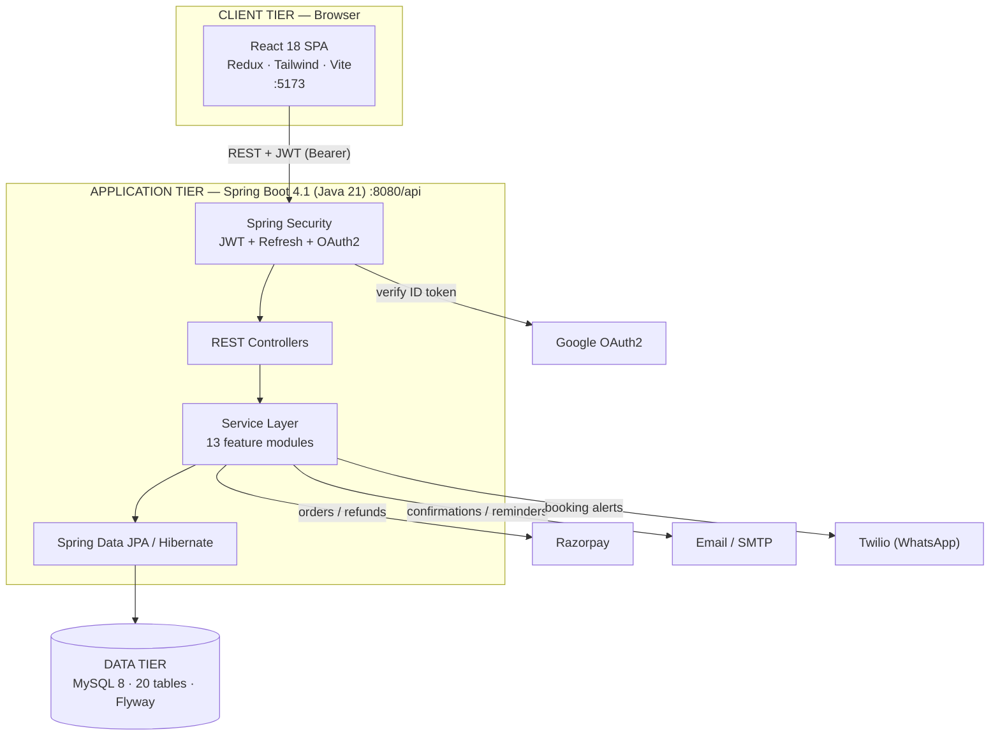
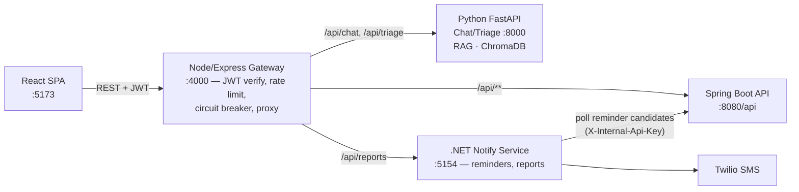
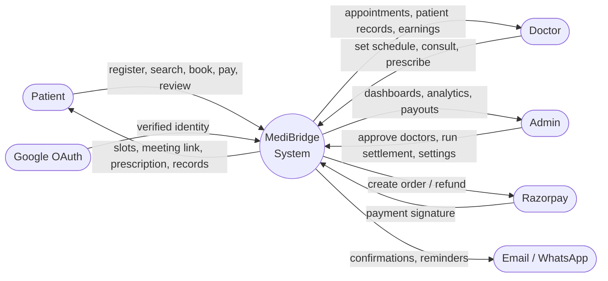
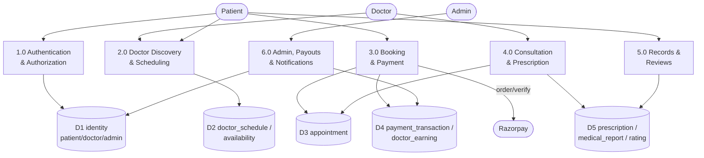
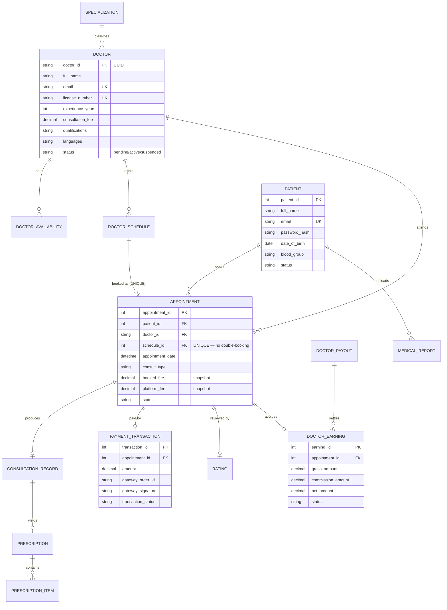
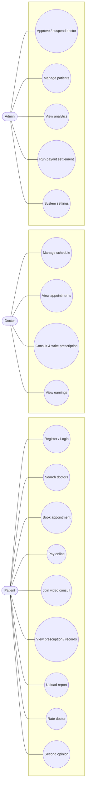
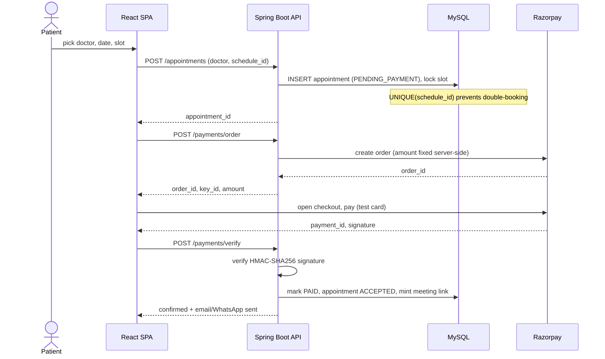
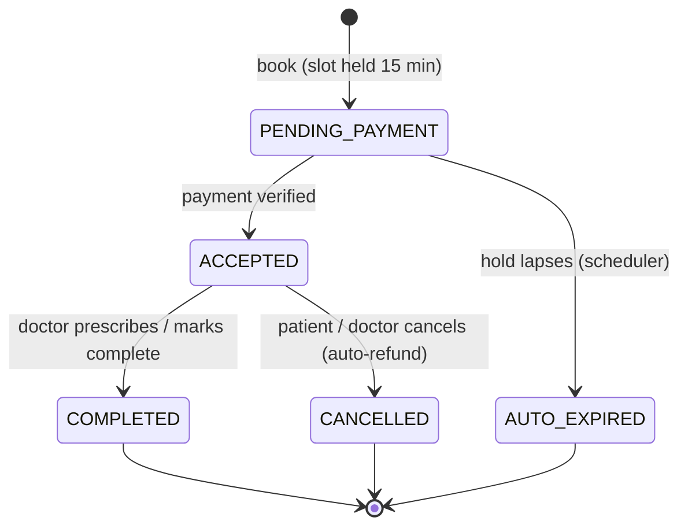

# MediBridge — Project Presentation & Explanation

**A full-stack telemedicine / online doctor-consultation platform.**
Prepared for project presentation (CDAC). This single document explains the
project end to end: problem, architecture, code flow (backend + frontend), and
every diagram an examiner asks for (Context/DFD, ER, Use Case, Class, Sequence,
State). The diagrams below are Mermaid — they render natively on GitHub and
in VS Code.

---

## 1. Problem statement & objective

Booking a doctor traditionally means phone calls, physical queues, paper
prescriptions and lost reports. **MediBridge** lets a patient:

- discover **verified** doctors by specialty, rating and fee,
- book a **real** appointment slot and **pay online**,
- consult by **secure video**, and
- keep every **prescription and report** in one place —

while doctors manage their schedule, consult and prescribe, and an admin
oversees the platform, approves doctors and settles their earnings.

**Objective:** build a secure, production-shaped, three-role healthcare platform
that models how real products (Practo, Apollo 24|7) actually work — correct
money handling, no double-booking, and role-based access control.

---

## 2. Technology stack

| Tier | Technology |
|---|---|
| **Frontend** | React 18, Redux Toolkit, React Router 6, Tailwind CSS, Vite, Axios |
| **Backend** | Java 21, Spring Boot 4.1, Spring Security 7, Spring Data JPA / Hibernate 7 |
| **Database** | MySQL 8, Flyway (versioned migrations) |
| **Auth** | JWT (access + refresh), BCrypt, Google OAuth2 |
| **Payments** | Razorpay (server-side order + signature verification) |
| **Others** | Email (SMTP), WhatsApp/SMS (Twilio), PDF (openhtmltopdf), Swagger/OpenAPI |
| **Gateway** | Node.js / Express, `http-proxy-middleware`, JWT verification, per-upstream circuit breaker |
| **Chat / Triage** | Python, FastAPI, SentenceTransformer embeddings, ChromaDB (RAG over an FAQ/symptom corpus) |
| **Notify service** | .NET 8, `BackgroundService` + `PeriodicTimer`, Twilio SMS, CSV report generation |

---

## 3. System architecture

Three tiers, a **modular monolith** on the backend (one deployable, organised
into feature modules — not microservices).



**Why a modular monolith?** One database and one deployment keep money
operations (book → pay → confirm → earn) in a single transaction — the
integrity guarantee a split into microservices would lose. Modules stay
decoupled by a rule: *a module may import another module's `Service` and `dto`,
never its `entity` or `repository`.*

### 3.1 Microservices extension

The core money/booking flow stays a monolith on purpose (see above), but three
satellite services sit around it for the pieces that genuinely benefit from
being separate — a **polyglot gateway architecture**, not a rewrite of the
monolith:



- **Gateway (Node/Express)** — the single entry point the frontend talks to.
  It **independently verifies the Spring-issued JWT** (HS384, shared secret)
  before proxying, so a bad/expired token is rejected in ~1ms without ever
  reaching Spring; adds rate limiting and a per-upstream circuit breaker so one
  slow downstream service can't cascade-fail the others.
- **Chat/Triage service (Python/FastAPI)** — a small RAG pipeline
  (SentenceTransformer embeddings → ChromaDB vector search) answering FAQ
  and symptom-checker questions. Python was chosen here specifically because
  the ML/embedding tooling is native to it — the one place polyglot pays off.
- **Notify service (.NET)** — a `BackgroundService` on a `PeriodicTimer`
  that polls a Spring-exposed internal endpoint for appointments due a
  reminder and sends them via Twilio SMS; also renders CSV reports for the
  admin dashboard on demand.
- **Internal-only trust boundary** — Spring's `/internal/**` endpoints and
  the chat-service both require a shared `X-Internal-Api-Key` header that
  only the gateway (and, for Spring, the notify-service) holds. A browser can
  never reach these directly, even if it discovers the URL.
- **Talking point:** this is intentionally a small, real microservices slice
  layered on top of a monolith — it demonstrates the pattern (independent
  deployability, a gateway as the trust boundary, a shared-secret internal
  API) without paying the full distributed-transaction cost for the
  booking/payment flow, which stays where ACID guarantees matter most.

---

## 4. Data Flow Diagrams

### 4.1 DFD Level 0 — Context diagram

The whole system as one process, with its external entities.



### 4.2 DFD Level 1 — Major processes & data stores



---

## 5. ER Diagram (database design)

20 tables; the core relationships:



**Design highlights (talking points):**
- **`appointment.schedule_id` is UNIQUE** → two patients can never take one slot,
  enforced by the *database*, not application code (race-proof).
- **`booked_fee` / `platform_fee` are snapshotted** onto the appointment at
  booking → a later price change can't alter what a booked patient owes.
- **Three separate identity tables** (patient/doctor/admin), each with its own
  `password_hash`.

---

## 6. Use Case Diagram



**Actors:** **Patient** (books & consults), **Doctor** (consults & prescribes),
**Admin** (governs the platform). A rendered version is
[`diagrams/03_use_case.png`](diagrams/03_use_case.png).

---

## 7. Sequence Diagram — Booking + Payment (the core flow)



---

## 8. Appointment state machine



---

## 9. Backend code flow (request lifecycle)

Every request follows the same layered path. Example: **booking an appointment.**

```
HTTP  POST /api/appointments   (Authorization: Bearer <JWT>)
  │
  ▼
JwtAuthFilter            validates the JWT signature/expiry, builds the
                         SecurityUser, puts it in the SecurityContext
  │
  ▼
SecurityConfig           URL rule: /appointments requires an authenticated user;
                         @PreAuthorize on the method requires ROLE_PATIENT
  │
  ▼
AppointmentController    @CurrentUser injects the caller's id (never trusts a
                         request parameter); validates the request body
  │
  ▼
AppointmentService       @Transactional business rules:
   .book(patientId, req)   • lock the slot row (findByIdForUpdate)
                           • reject if already booked
                           • snapshot fee + platform fee
                           • save appointment PENDING_PAYMENT
                           • publish/notify (booking pending)
  │
  ▼
JpaRepository → MySQL    INSERT; the UNIQUE(schedule_id) constraint is the final
                         guard against a double-booking race
  │
  ▼
AppointmentMapper        entity → AppointmentResponse DTO (snake_case JSON)
  │
  ▼
HTTP 200  { appointment_id, doctor, time, status, ... }
```

**Layers, one responsibility each:**
`Controller` (HTTP + auth annotations) → `Service` (business rules,
`@Transactional`, **ownership checks**) → `Repository` (data access) → MySQL.
Cross-module reactions use **Spring events** (e.g. *AppointmentCompleted →
accrue doctor earning*), so publishers stay unaware of listeners.

---

## 10. Frontend code flow (data flow)

The React app is a **service-layer + Redux** architecture. A page never talks to
HTTP directly.

```
Page component (e.g. FindDoctors.jsx)
  │  dispatch(fetchDoctors())            ← fired from a useEffect on mount
  ▼
Redux thunk (doctorsSlice.js)            createAsyncThunk
  │  calls a service method
  ▼
Service (services/doctorService.js)      if (USE_MOCK) return mock
  │                                      else axiosClient.get('/doctors')
  ▼
axiosClient (Axios instance)             request interceptor attaches
  │                                      Authorization: Bearer <mb_token>
  ▼
Spring Boot API  →  JSON response
  │
  ▼
slice reducers update state              status: loading → succeeded
  │
  ▼
Component re-renders via useSelector     renders the doctor cards
```

**Key ideas to mention:**
- **`USE_MOCK` flag** — the whole app runs against mock data with one env flag,
  then switches to the real backend by flipping it. Components never branch on it.
- **Auth persistence** — `authSlice` stores the token in `localStorage`; the
  Axios interceptor attaches it and refreshes it on a 401.
- **Routing** — `ProtectedRoute` guards each route on `isAuthenticated` + exact
  role, giving three route trees: `/patient/*`, `/doctor/*`, `/admin/*`.

---

## 11. Modules (backend)

| Module | Responsibility |
|---|---|
| `auth` | login, registration, JWT refresh, Google OAuth |
| `patient` | profile, password change, stats |
| `doctor` | listing/search, availability, schedule, profile |
| `appointment` | booking, cancel, reschedule, complete, dashboards, slot-expiry scheduler |
| `record` | medical report upload/download (UUID filename, allow-listed type) |
| `prescription` | consultation records, e-prescriptions, PDF data |
| `payment` | Razorpay orders, signature verification, refunds |
| `payout` | doctor earnings ledger + settlement batches |
| `review` | ratings + highlights, doctor rating recalculation |
| `admin` | dashboard, analytics, user management, system settings |
| `notification` | email + WhatsApp + meeting-link generation |
| `pdf` | Thymeleaf → PDF rendering |
| `common` | security, config, exceptions, enum converters |

---

## 12. Security (for the viva)

- **Stateless JWT** (HS256, 15-min access) + **refresh token** (SHA-256 hashed,
  rotated).  **BCrypt(12)** password hashing.
- **Three-layer authorization:** URL role gates → `@PreAuthorize` → **ownership
  checks in the service layer** (`findByIdAndPatientId`).
- **404 not 403** on ownership failure (doesn't confirm a resource exists);
  **generic login errors** (no account enumeration).
- **Payments:** amount fixed server-side; **HMAC-SHA256 signature verified**
  server-side with a constant-time compare; key secret never leaves the server.
- **Uploads:** UUID filename + allow-listed content type (no path traversal).
- Secrets live only in a **gitignored** `application-local.yml`.

---

## 13. How to run

```bash
# Backend  (from medibridge-backend/)
mvn spring-boot:run -Dspring-boot.run.profiles=local     # :8080/api

# Gateway  (from medibridge-gateway/)
npm install && npm run dev                                # :4000

# Chat/Triage service (from medibridge-chat-service/)
uvicorn app.main:app --reload                              # :8000

# Notify service (from medibridge-notify-service/src/MediBridge.Notify.Api/)
dotnet run                                                  # :5154

# Frontend (from medibridge-frontend/)
npm install && npm run dev                                # :5173, routed through the gateway
```

**Demo logins** — Patient `aarav.gupta@email.com` / `Test@1234` ·
Doctor `aditya.nair@medibridge.com` / `Test@1234` ·
Admin `admin@medibridge.com` / `Admin@123` (at `/admin/login`).

---

## 14. Features

Patient: search + specialty filter · doctor profiles (reviews, qualifications,
languages) · slot booking · online payment · video consult · e-prescriptions ·
medical records + health timeline · **Second Opinion** · **Symptom Checker**.
Doctor: schedule, appointments, prescribe, earnings & payouts.
Admin: approve doctors, manage users, analytics + CSV export, payout settlement,
system settings.

## 15. Future scope

Instant Consult ("talk now"), in-app chat, medicine ordering & lab tests,
insurance integration, mobile app, login rate-limiting.

---

*Deep-dive docs: [../README.md](../README.md) (architecture, service
responsibilities, request flow) · [DATABASE.md](DATABASE.md) (schema) ·
[BUSINESS_LOGIC.md](BUSINESS_LOGIC.md) (every business rule end to end).*
